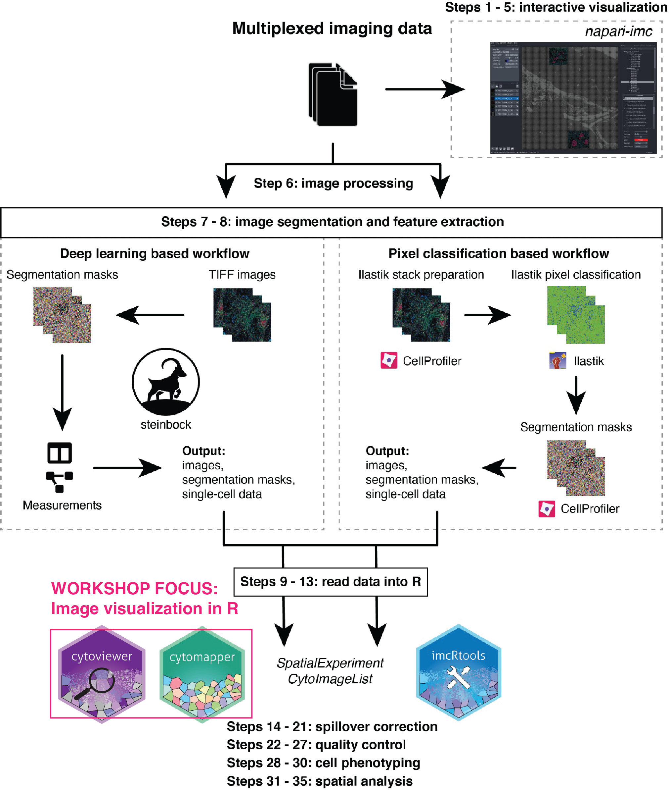

`r fontawesome::fa(name = "github", fill = "#333")` <a href="https://github.com/nilseling">@nilseling</a>  
`r fontawesome::fa(name = "twitter", fill = "#1DA1F2")` <a href="https://twitter.com/NilsEling">@NilsEling</a> 

# Data and code availability

To follow this tutorial, please visit
[https://github.com/BodenmillerGroup/demos/tree/main/docs](https://github.com/BodenmillerGroup/cytomapper_demos/tree/main/docs).
The compiled .html of this workshop is hosted at:
[https://bodenmillergroup.github.io/demos](https://bodenmillergroup.github.io/demos).
The
[imcRtools](https://www.bioconductor.org/packages/release/bioc/html/cytomapper.html)
package can be installed via:

```{r installation, eval=FALSE}
if (!requireNamespace("BiocManager", quietly = TRUE))
    install.packages("BiocManager")

BiocManager::install("imcRtools")
```

To reproduce the analysis, clone the repository:

```
git clone https://github.com/BodenmillerGroup/demos.git
```

and open the `Bioc2022_workshop.Rmd` file in the `docs` folder.

# Introduction



The `steinbock` package...

The `imcRtools` package contains three broad functionalities:


We use [imaging mass cytometry](https://www.nature.com/articles/nmeth.2869) data
to highlight the functionality of the `cytomapper` package. However, any imaging
technology is supported as long as the data can be read into R (memory
restrictions and file type restrictions.)

# Image processing

Throughout this tutorial, we will access a number of different data types. 
To declutter the analysis scripts, we will already download all needed data here.

To highlight the basic steps of IMC data analysis, we provide example data that
were acquired as part of the **I**ntegrated i**MMU**noprofiling of large adaptive
**CAN**cer patient cohorts projects ([immucan.eu](https://immucan.eu/)). The
raw data of 4 patients can be accessed online at 
[zenodo.org/record/5949116](https://zenodo.org/record/5949116) the
sample/patient metadata information here:


## TODO: Dowload the raw data

```{r download-raw}
download.file("https://zenodo.org/record/5949116/files/panel.csv",
              "data/steinbock/raw/panel.csv")
download.file("https://zenodo.org/record/5949116/files/Patient1.zip",
              "data/steinbock/raw/Patient1.zip")
download.file("https://zenodo.org/record/5949116/files/Patient2.zip",
              "data/steinbock/raw/Patient2.zip")
download.file("https://zenodo.org/record/5949116/files/Patient3.zip",
              "data/steinbock/raw/Patient3.zip")
download.file("https://zenodo.org/record/5949116/files/Patient4.zip",
              "data/steinbock/raw/Patient4.zip")
```

## The steinbock framework

```{bash}
#!/usr/bin/env bash
BASEDIR=$(cd -- "$(dirname "${BASH_SOURCE[0]}")" && pwd -P)

alias steinbock="docker run -v ${BASEDIR}:/data -u $(id -u):$(id -g) ghcr.io/bodenmillergroup/steinbock:0.14.2"

# panel pre-processing
steinbock preprocess imc panel --namecol Clean_Target

# file type conversion and filtering
steinbock preprocess imc images --hpf 50

# deep learning-based segmentation
steinbock segment deepcell --minmax

# measurement
steinbock measure intensities
steinbock measure regionprops
steinbock measure neighbors --type expansion --dmax 4
```

## Reading in single-cell data

## Reading in images

The `cytomapper::loadImages` function reads in multi-channel images and segmentation masks into `CytoImageList` objects.

```{r, reading-in-data-1, message=FALSE}
library(cytomapper)

# Read in 32-bit multi-channel images
(images <- loadImages("../data/images/", pattern = ".tiff"))

# Read in 16-bit unsigned integer segmentation masks
(masks <- loadImages("../data/masks/", pattern = ".tiff"))
```

It is always recommended to observe the numeric pixel values to make sure that
images were read in correctly:

```{r histograms}
# multi-channel images - first image, first channel
hist(log10(images[[1]][,,1] + 1))

# Segmentation mask
masks[[1]]
```

We notice, that the segmentation masks were not read in as integer images. 
This behavior arises due to issues with accessing the `tiff` metadata after
pre-processing using `CellProfiler`.

In these cases, the `cytomapper::scaleImages` function can be used to rescale
segmentation masks to only contain integer IDs. Here, the scaling factor
is `2 ^ 16 - 1 = 65535` accounting for the 16-bit unsigned integer encoding.

```{r scaleImages}
masks <- scaleImages(masks, 2 ^ 16 - 1)

masks[[1]]
```

As an alternative, while reading in the images, the `as.is` option can be set to `TRUE`.

```{r as.is}
masks <- loadImages("../data/masks/", pattern = ".tiff", as.is = TRUE)

masks[[1]]
```

We can already visualize the segmentation mask to get an idea of the tissue 
structure:

```{r mask-viz}
plotCells(masks)
```

# Spatial analysis


# Further resources

For pre-processing multiplexed imaging data, please refer to the [ImcSegmentationPipeline](https://github.com/BodenmillerGroup/ImcSegmentationPipeline) and/or the
[steinbock](https://github.com/BodenmillerGroup/steinbock) package.

To test the `cytomapper` package on different datasets, check out the [imcdatasets](https://bioconductor.org/packages/release/data/experiment/html/imcdatasets.html) Bioconductor package.

The [imcRtools](https://github.com/BodenmillerGroup/imcRtools) package is currently being developed
to facilitate handling of multiplexed imaging data and spatial analysis.

# Session info {.unnumbered}

```{r sessionInfo, echo=FALSE}
sessionInfo()
```
