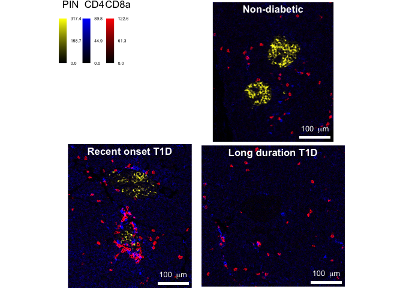
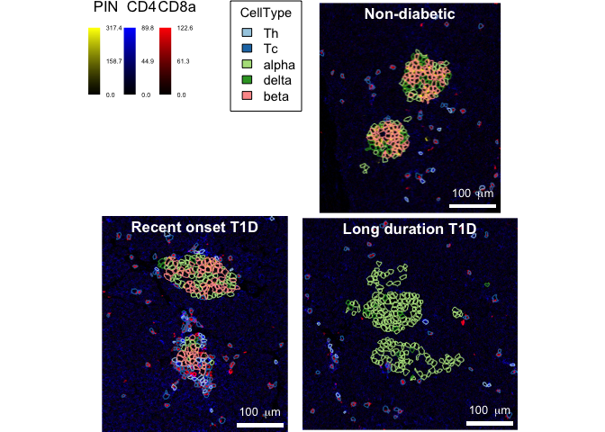

This script serves as an example to highlight the usage of the
[cytomapper](https://www.bioconductor.org/packages/release/bioc/html/cytomapper.html)
R/Bioconductor package. It was written for the [Indiana O’Brien Center
Microscopy
Workshop](http://static.medicine.iupui.edu/obrien/2021Schedule.pdf) in
June 2021.

## Prerequisites

To use this script, first you will need to [install
R](https://www.r-project.org/) and install the `cytomapper` package via:

    if (!requireNamespace("BiocManager", quietly = TRUE))
        install.packages("BiocManager")

    BiocManager::install("cytomapper")

For convenience, please open the provided `cytomapper_demos.Rproj` file.
This will correctly set the working directory.

For complete instructions on how to use the `cytomapper` package, please
refer to the [official
vignette](https://bioconductor.org/packages/release/bioc/vignettes/cytomapper/inst/doc/cytomapper.html).

## Reading in example data

In the first instance, we will read in the example data provided in this
repository. To read in images, the `cytomapper` package provides the
`loadImages` function. The cell-specific mean ion counts and metadata
are stored in form of a
[SingleCellExperiment](https://bioconductor.org/packages/release/bioc/html/SingleCellExperiment.html)
object.

    library(cytomapper)

    # Read in multi-channel images
    (images <- loadImages("../data/images/", pattern = ".tiff"))

    ## CytoImageList containing 3 image(s)
    ## names(3): E30_a0_full_clean G23_a0_full_clean J01_a0_full_clean 
    ## Each image contains 38 channel(s)

    # Read in masks
    (masks <- loadImages("../data/masks/", pattern = ".tiff", as.is = TRUE))

    ## CytoImageList containing 3 image(s)
    ## names(3): E30_a0_full_mask G23_a0_full_mask J01_a0_full_mask 
    ## Each image contains 1 channel

    # Read in single-cell data
    (sce <- readRDS("../data/sce.rds"))

    ## class: SingleCellExperiment 
    ## dim: 38 5819 
    ## metadata(0):
    ## assays(2): counts exprs
    ## rownames(38): H3 SMA ... Ir191 Ir193
    ## rowData names(15): TubeNb MetalTag ... miCAT2 miCAT
    ## colnames(5819): E30_1 E30_2 ... J01_2173 J01_2174
    ## colData names(26): slide id ... Ethnicity BMI
    ## reducedDimNames(0):
    ## mainExpName: NULL
    ## altExpNames(0):

    # Display the cell-specific metadata
    colData(sce)

    ## DataFrame with 5819 rows and 26 columns
    ##                slide          id ImageNumber CellNumber     Pos_X     Pos_Y
    ##          <character> <character>   <integer>  <integer> <numeric> <numeric>
    ## E30_1              E       E30_1         166          1   171.375   0.62500
    ## E30_2              E       E30_2         166          2   149.400   1.60000
    ## E30_3              E       E30_3         166          3     6.400   3.36471
    ## E30_4              E       E30_4         166          4   220.756   2.85366
    ## E30_5              E       E30_5         166          5   189.523   4.95455
    ## ...              ...         ...         ...        ...       ...       ...
    ## J01_2170           J    J01_2170         286       2170   435.950   453.050
    ## J01_2171           J    J01_2171         286       2171   456.469   452.688
    ## J01_2172           J    J01_2172         286       2172   340.643   453.643
    ## J01_2173           J    J01_2173         286       2173    19.900   454.500
    ## J01_2174           J    J01_2174         286       2174    43.250   454.625
    ##          ParentIslet ClosestIslet      Area NbNeighbours          ImageFullName
    ##            <integer>    <integer> <integer>    <integer>            <character>
    ## E30_1              0            1         8            2 E30_a0_full_clean.tiff
    ## E30_2              0            1         5            2 E30_a0_full_clean.tiff
    ## E30_3              0            1        85            3 E30_a0_full_clean.tiff
    ## E30_4              0            1        41            4 E30_a0_full_clean.tiff
    ## E30_5              0            1        44            5 E30_a0_full_clean.tiff
    ## ...              ...          ...       ...          ...                    ...
    ## J01_2170           0            1        40            4 J01_a0_full_clean.tiff
    ## J01_2171           0            1        64            3 J01_a0_full_clean.tiff
    ## J01_2172           0            1        42            3 J01_a0_full_clean.tiff
    ## J01_2173           0            1        10            3 J01_a0_full_clean.tiff
    ## J01_2174           0            1        16            2 J01_a0_full_clean.tiff
    ##              width    height   ImageName     CellCat    CellType      case
    ##          <integer> <integer> <character> <character> <character> <integer>
    ## E30_1          390       452         E30    exocrine      ductal      6126
    ## E30_2          390       452         E30      immune  macrophage      6126
    ## E30_3          390       452         E30    exocrine      acinar      6126
    ## E30_4          390       452         E30    exocrine      acinar      6126
    ## E30_5          390       452         E30    exocrine      ductal      6126
    ## ...            ...       ...         ...         ...         ...       ...
    ## J01_2170       463       456         J01    exocrine      ductal      6180
    ## J01_2171       463       456         J01    exocrine      acinar      6180
    ## J01_2172       463       456         J01    exocrine      acinar      6180
    ## J01_2173       463       456         J01    exocrine      acinar      6180
    ## J01_2174       463       456         J01    exocrine      acinar      6180
    ##                 part     group         stage  duration  Aab.status       Age
    ##          <character> <integer>   <character> <numeric> <character> <numeric>
    ## E30_1           Tail         1  Non-diabetic        NA    Negative      25.2
    ## E30_2           Tail         1  Non-diabetic        NA    Negative      25.2
    ## E30_3           Tail         1  Non-diabetic        NA    Negative      25.2
    ## E30_4           Tail         1  Non-diabetic        NA    Negative      25.2
    ## E30_5           Tail         1  Non-diabetic        NA    Negative      25.2
    ## ...              ...       ...           ...       ...         ...       ...
    ## J01_2170        Tail         2 Long-duration        11    Positive        27
    ## J01_2171        Tail         2 Long-duration        11    Positive        27
    ## J01_2172        Tail         2 Long-duration        11    Positive        27
    ## J01_2173        Tail         2 Long-duration        11    Positive        27
    ## J01_2174        Tail         2 Long-duration        11    Positive        27
    ##               Gender   Ethnicity       BMI
    ##          <character> <character> <numeric>
    ## E30_1              M   Caucasian      25.1
    ## E30_2              M   Caucasian      25.1
    ## E30_3              M   Caucasian      25.1
    ## E30_4              M   Caucasian      25.1
    ## E30_5              M   Caucasian      25.1
    ## ...              ...         ...       ...
    ## J01_2170           M   Caucasian      25.9
    ## J01_2171           M   Caucasian      25.9
    ## J01_2172           M   Caucasian      25.9
    ## J01_2173           M   Caucasian      25.9
    ## J01_2174           M   Caucasian      25.9

Here, mean ion counts are stored in `counts(sce)` and cell-associated
metadata are stored in `colData(sce)`.

## Add image metadata

To easily select markers for display, the `channelNames` of the
multi-channel image object needs to be set. Furthermore, to match
segmentation masks with multi-channel images, image-level metadata needs
to be added.

    # Add channel names
    channelNames(images) <- rownames(sce)

    # Add image name to metadata
    (mcols(images) <- mcols(masks) <- DataFrame(ImageName = c("E30", "G23", "J01")))

    ## DataFrame with 3 rows and 1 column
    ##     ImageName
    ##   <character>
    ## 1         E30
    ## 2         G23
    ## 3         J01

## Visualize multi-channel images

In the first instance, we can use `cytomapper` to visualize pixel
intensities of multi-channel images. The `plotPixels` function takes at
least the `images` object storing multi-channel images. Via the
`colour_by` parameter, up to six channels can be selected for display.
The `colour` parameter specifies the range of the colour palette used to
display the individual channels. Background, contrast and alpha of each
channel can be set via the `bcg` parameter. Visual appearance of the
image title can be adjusted via setting `image_title` and the scale bar
can be set via the `scale_bar` parameter.

Here, we can display the markers pro-insulin (PIN, beta cells), CD4
(helper T cells) and CD8a (cytotoxic T cells).

    plotPixels(image = images,
               colour_by = c("PIN", "CD4", "CD8a"), 
               colour = list(PIN = c("black", "yellow"),
                             CD4 = c("black", "blue"),
                             CD8a = c("black", "red")),
               bcg = list(PIN = c(0, 10, 1),
                          CD4 = c(0, 8, 1),
                          CD8a = c(0, 10, 1)),
               image_title = list(text = c("Non-diabetic",
                                           "Recent onset T1D",
                                           "Long duration T1D")),
               scale_bar = list(length = 100,
                                label = expression("100 " ~ mu * "m")))

## Visualize segmented cells

By incorporating information stored in the `SingleCellExperiment`
object, cell-specific metadata can be displayed on the segmentation
masks. Here, each cell is defined as a set of pixels with the same
integer. The `SingleCellExperiment` object must contain an entry storing
these integer ids (here the entry can be accessed via
`colData(sce)$CellNumber`). Furthermore, `colData(sce)$ImageName` stores
the name of the image to which each cell belongs. This parameter is
needed to map each cell to its associated segmentation mask.

Here, we subset the `SingleCellExperiment` object to only contain islet
cells (`alpha`, `beta` and `delta`) and helper T cells (`Th`) and
cytotoxic T cells (`Tc`). In that way, only the selected cells are
displayed. All other cells are coloured using the colour specified via
the `missing_colour` parameter.

    cur_sce <- sce[,sce$CellType %in% c("beta", "alpha", "delta", "Tc", "Th")]

    plotCells(mask = masks,
              object = cur_sce,
              cell_id = "CellNumber",
              img_id = "ImageName",
              colour_by = "CellType",
              image_title = list(text = c("Non-diabetic",
                                          "Recent onset T1D",
                                          "Long duration T1D"),
                                 colour = "black"),
              scale_bar = list(length = 100,
                               label = expression("100 " ~ mu * "m"),
                               colour = "black"),
              missing_colour = "white",
              background_colour = "gray")

## Outline cells on images

In the final step, we can combine the multi-channel `images`, the
segmentation `masks` and the single-cell data contained in the
`SingleCellExperiment` object to outline the selected cells on top of
the composite images.

    plotPixels(image = images,
               object = cur_sce,
               mask = masks,
               cell_id = "CellNumber",
               img_id = "ImageName",
               colour_by = c("PIN", "CD4", "CD8a"), 
               outline_by = "CellType",
               colour = list(PIN = c("black", "yellow"),
                             CD4 = c("black", "blue"),
                             CD8a = c("black", "red")),
               bcg = list(PIN = c(0, 10, 1),
                          CD4 = c(0, 8, 1),
                          CD8a = c(0, 10, 1)),
               image_title = list(text = c("Non-diabetic",
                                           "Recent onset T1D",
                                           "Long duration T1D")),
               scale_bar = list(length = 100,
                                label = expression("100 " ~ mu * "m")),
               thick = TRUE)

## Gate cells on images

Finally, the `cytomapperShiny` function can be used to gate cells based
on their expression values. Gates cells are shown in form of outlines on
the images.

    if (interactive()) {
        cytomapperShiny(sce, mask = masks, image = images, 
                        cell_id = "CellNumber", img_id = "ImageName")
    }

## Session info

    sessionInfo()

    ## R version 4.1.0 (2021-05-18)
    ## Platform: x86_64-apple-darwin17.0 (64-bit)
    ## Running under: macOS Catalina 10.15.7
    ## 
    ## Matrix products: default
    ## BLAS:   /Library/Frameworks/R.framework/Versions/4.1/Resources/lib/libRblas.dylib
    ## LAPACK: /Library/Frameworks/R.framework/Versions/4.1/Resources/lib/libRlapack.dylib
    ## 
    ## locale:
    ## [1] en_US.UTF-8/en_US.UTF-8/en_US.UTF-8/C/en_US.UTF-8/en_US.UTF-8
    ## 
    ## attached base packages:
    ## [1] parallel  stats4    stats     graphics  grDevices utils     datasets 
    ## [8] methods   base     
    ## 
    ## other attached packages:
    ##  [1] cytomapper_1.4.1            SingleCellExperiment_1.14.1
    ##  [3] SummarizedExperiment_1.22.0 Biobase_2.52.0             
    ##  [5] GenomicRanges_1.44.0        GenomeInfoDb_1.28.0        
    ##  [7] IRanges_2.26.0              S4Vectors_0.30.0           
    ##  [9] BiocGenerics_0.38.0         MatrixGenerics_1.4.0       
    ## [11] matrixStats_0.59.0          EBImage_4.34.0             
    ## 
    ## loaded via a namespace (and not attached):
    ##  [1] viridis_0.6.1          viridisLite_0.4.0      svgPanZoom_0.3.4      
    ##  [4] shiny_1.6.0            assertthat_0.2.1       highr_0.9             
    ##  [7] sp_1.4-5               GenomeInfoDbData_1.2.6 vipor_0.4.5           
    ## [10] tiff_0.1-8             yaml_2.2.1             pillar_1.6.1          
    ## [13] lattice_0.20-44        glue_1.4.2             digest_0.6.27         
    ## [16] RColorBrewer_1.1-2     promises_1.2.0.1       XVector_0.32.0        
    ## [19] colorspace_2.0-1       htmltools_0.5.1.1      httpuv_1.6.1          
    ## [22] Matrix_1.3-3           pkgconfig_2.0.3        raster_3.4-10         
    ## [25] zlibbioc_1.38.0        purrr_0.3.4            xtable_1.8-4          
    ## [28] fftwtools_0.9-11       scales_1.1.1           svglite_2.0.0         
    ## [31] HDF5Array_1.20.0       jpeg_0.1-8.1           later_1.2.0           
    ## [34] BiocParallel_1.26.0    tibble_3.1.2           generics_0.1.0        
    ## [37] ggplot2_3.3.3          ellipsis_0.3.2         magrittr_2.0.1        
    ## [40] crayon_1.4.1           mime_0.10              evaluate_0.14         
    ## [43] fansi_0.5.0            beeswarm_0.4.0         shinydashboard_0.7.1  
    ## [46] tools_4.1.0            lifecycle_1.0.0        stringr_1.4.0         
    ## [49] Rhdf5lib_1.14.0        munsell_0.5.0          locfit_1.5-9.4        
    ## [52] DelayedArray_0.18.0    compiler_4.1.0         systemfonts_1.0.2     
    ## [55] rlang_0.4.11           rhdf5_2.36.0           grid_4.1.0            
    ## [58] RCurl_1.98-1.3         rhdf5filters_1.4.0     htmlwidgets_1.5.3     
    ## [61] bitops_1.0-7           rmarkdown_2.8          codetools_0.2-18      
    ## [64] gtable_0.3.0           abind_1.4-5            DBI_1.1.1             
    ## [67] R6_2.5.0               gridExtra_2.3          knitr_1.33            
    ## [70] dplyr_1.0.6            fastmap_1.1.0          utf8_1.2.1            
    ## [73] stringi_1.6.2          ggbeeswarm_0.6.0       Rcpp_1.0.6            
    ## [76] vctrs_0.3.8            png_0.1-7              tidyselect_1.1.1      
    ## [79] xfun_0.23
